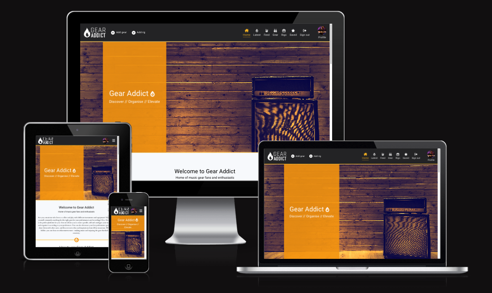
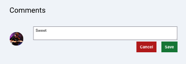

# **Gear Addict**

Gear Addict is an online application that allows users to add and categorise their music gear, and also share details about their live rigs with the community. Users can interact with other users by becoming a fan, as well as liking, commenting and saving rigs.

This project was built as the final portfolio submission for the [Code Institute](https://codeinstitute.net/) Higher National Diploma in Full Stack Software Development. 

The project has been split into two parts - the front-end built with [React](https://react.dev/), and the back-end API powered by the [Django REST Framework](https://www.django-rest-framework.org/). 

More information on the back-end of the site can be found in the back-end [README](https://github.com/Matthew-Hurrell/gear-addict-api/blob/main/README.md).

Link to the live site - [Gear Addict Live Site](https://gear-addict-react.herokuapp.com/)

Link to the live API - [Gear Addict Live API](https://gear-addict.herokuapp.com/)

Link to the back-end repository - [Gear Addict Back-End Repo](https://github.com/Matthew-Hurrell/gear-addict-api)

# Contents

* [**Project**](<#project>)
    * [Objective](<#objective>)
    * [Site User Goal](<#site-user-goal>)
    * [Site Owner Goal](<#site-owner-goal>)
    * [Target Audience](<#target-audience>)
    * [**Project Management**](<#project-management>)
        * [GitHub Project Board](<#github-project-board>)
        * [Database Schema](<#database-schema>)
* [**User Experience UX**](<#user-experience-ux>)
    * [Wireframes](<#wireframes>)
    * [User Stories](<#user-stories>)
    * [Site Structure](<#site-structure>)
    * [Colour Scheme](<#colour-scheme>)
    * [Typography](<#typography>)
* [**Features**](<#features>)
    * [**Existing Features**](<#existing-features>)
        * [**Homepage**](<#homepage>)
        * [**Authorisation**](<#authorisation>)
            * [Sign Up](<#sign-up>)
            * [Log In](<#log-in>)
            * [Log Out](<#log-out>)
        * [**404 Page**](<#404-page>)
    * [**Future Features**](<#future-features>)
* [**Components**](<#components>)
* [**Technologies Used**](<#technologies-used>)
    * [Languages](<#languages>)
    * [Frameworks](<#frameworks>)
    * [Software](<#software>)
    * [Libraries](<#libraries>)
* [**Testing**](<#testing>)
    * [**Validator Tests**](<#validator-tests>)
        * [W3C (HTML)](<#w3c-html>)
        * [W3C (CSS)](<#w3c-css>)
        * [JSHint (JavaScript)](<#jshint-javascript>)
    * [**Input Validation Tests**](<#input-validation-tests>)
    * [**Additional Tests**](<#additional-tests>)
        * [Manual Tests](<#manual-tests>)
        * [Automated Tests](<#automated-tests>)
        * [Responsive Tests](<#responsive-tests>)
        * [Browser Tests](<#browser-tests>)
        * [Lighthouse Tests](<#lighthouse-tests>)
        * [Wave Accessibility Tests](<#wave-accessibility-tests>)
    * [**Bugs**](<#bugs>)
        * [Resolved](<#resolved>)
        * [Unresolved](<#unresolved>)
* [**Deployment**](<#deployment>)
    * [**Project Deployment Via Heroku**](<#project-deployment-via-heroku>)
* [**Credits**](<#credits>)
    * [**Content**](<#content>)
    * [**Media**](<#media>)
    * [**Code**](<#code>)
*  [**Acknowledgements**](<#acknowledgements>)

# Project

In this section I will detail the projects purpose and goals, as well as the project management methodologies used throughout the development process.

[Back to top](<#contents>)

## Objective

To provide a stable platform for music gear enthusiasts and collectors to organise and share their music gear and live rigs.

[Back to top](<#contents>)

## Site User Goal

Users of the Gear Addict site may have many different goals. They may wish to categorise and organise their music gear, or they may want to share their live setup with other users who have similar interests. They could just be interested in browsing other users live rigs for general interest or inspiration, or they may just wish to interact and network with the community to provide feedback.

[Back to top](<#contents>)

## Site Owner Goal

To provide a stable and enjoyable user experience that encourages continued user interaction and participation. The platform should be engaging and welcoming to new users. Content should be well structured and of high quality. Navigation and site functionality should be intuitive and accessible. 

[Back to top](<#contents>)

## Target Audience

The target audience is anyone who has an interest in live music performance and music gear. Most users will be musicians, but there could also be some collectors on the platform. Users could be male or female, but the site is styled more towards a young male audience, as this is likely to be the majority of the users. 

[Back to top](<#contents>)

## Project Management

An agile methodology was used to plan and develop the Gear Addict project. All the main features of the application were recorded as epics and then refined into user stories. These user stories were created and stored as GitHub issues and then mapped into iterations to help to plan and allocate the workload. 

[Back to top](<#contents>)

### GitHub Project Board

All the Gear Addict user stories were added to a GitHub project board to assist with tracking progress. All user stories started in the to-do section. On completion, each user story was moved into the done section and marked as closed. 

[Click here to view the Gear Addict Project Board](https://github.com/users/Matthew-Hurrell/projects/3)

[Back to top](<#contents>)

### Database Schema

More information on the database schema can be found on the [Gear Addict Back-end API project readme](https://github.com/Matthew-Hurrell/gear-addict-api/blob/main/README.md).

[Back to top](<#contents>)

# User Experience UX

This section will detail the planning and design choices for the Gear Addict application.

[Back to top](<#contents>)

## Wireframes

Wireframes for the Gear Addict project were created using [Balsamiq](https://balsamiq.com/). All wireframes were completed pre-development. These wireframes were used as the basis for the Gear Addict page and component designs. Some minor changes were made during the development process.

### Home Page

[Back to top](<#contents>)

### Sign Up Page

[Back to top](<#contents>)

### Sign-In Page

[Back to top](<#contents>)

### All Rigs Page

[Back to top](<#contents>)

### Rig Details Page

[Back to top](<#contents>)

### Saved Rigs Page

[Back to top](<#contents>)

### Add Rig Page

[Back to top](<#contents>)

### Add Gear Page

[Back to top](<#contents>)

### My Gear Page

[Back to top](<#contents>)

### Profile Page

[Back to top](<#contents>)

### 404 Page

[Back to top](<#contents>)

## User Stories

In terms of project management, user stories are an integral part of the software development creative process. Gear Addict consists of 60 user stories, each broken down into acceptance criteria and tasks. Each user story has a story points number in relation to the time / difficulty of the tasks, and a priority label signifying the importance of the feature. The user stories were created from 'Epics', which are large over-arching features/concepts. These epics were refined down into smaller individual parts and made into user stories. Completed user stories were marked as closed. Throughout development, user stories were sorted into weekly iterations that were used to structure and allocate the workload each week. Each iteration was planned to not include more than 60% must-have user stories.

A full list of user stories can be found in a separate file here - [Gear Addict User Stories](https://github.com/Matthew-Hurrell/gear-addict/blob/main/readme/userstories.md)

[Back to top](<#contents>)

## Site Structure

The site structure for the Gear Addict application was kept relatively simple and user-friendly to avoid confusion. The main site nav bar and footer nav are present on every page of the site, to allow for easy access to site navigation. Non-authenticated users have limited access to pages within the site, and this is reflected in the changing state of the nav menus. Non logged in users only have access to the home, latest, rig detail, other user profiles and log-in / sign-up auth pages. Authenticated users can access the add rig / gear forms as well as the feed, gear, rigs, saved, user profile page and sign-out functionality. 

[Back to top](<#contents>)

## Colour Scheme

The Gear Addict colour scheme colours were selected from the inbuilt Tailwind colours from the [Tailwind CSS Customizing Colors List](https://tailwindcss.com/docs/customizing-colors). They were chosen for their modern and professional look and feel.

[Back to top](<#contents>)

## Typography

Gear Addict uses [Google Fonts](https://fonts.google.com/) for its typography. [Roboto](https://fonts.google.com/specimen/Roboto?query=roboto) was used for headings, links and nav elements. Roboto is a neo-grotesque sans-serif typeface and it was chosen for its modern geometric look. [Cardo](https://fonts.google.com/specimen/Cardo?query=cardo) was used for paragraphs and lists. Cardo is a large Unicode font, and it was chosen to add some contrast between the Roboto font and because it works well for general typesetting.

[Back to top](<#contents>)

# Features

This section will detail the features and components present in the Gear Addict application, as well as possible future features.

[Back to top](<#contents>)

## Existing Features

### Sign-Up Page

The sign-up page was created to allow users to register their details and sign-up for an account. On successful form submission the user is redirected to the sign in page to sign into their new account.

[Click here to view the user story](https://github.com/Matthew-Hurrell/gear-addict/issues/1)

[Back to top](<#contents>)

### Sign-In Page

The sign-in page was created to allow users to sign into their account to access all of the Gear Addict features. On successful form submission, the user is redirected back to the last page they were on.

[Click here to view the user story](https://github.com/Matthew-Hurrell/gear-addict/issues/2)

[Back to top](<#contents>)

### Sign Out

The Gear Addict sign-out functionality doesn't have its own page. The user simply clicks the sign out button in one of the nav menus and they are signed out of their account and redirected back to the home page.

[Click here to view the user story](https://github.com/Matthew-Hurrell/gear-addict/issues/3)

[Back to top](<#contents>)

### Home Page

The Gear Addict homepage features the homepage hero component as well as the intro component, how-to component and the hottest rigs list. This is the central area for the Gear Addict application.

[Click here to view the how to use section user story](https://github.com/Matthew-Hurrell/gear-addict/issues/61)

[Click here to view the view list of hottest rigs user story](https://github.com/Matthew-Hurrell/gear-addict/issues/58)

[Back to top](<#contents>)

### Latest Rigs Page

The latest rigs page is available to view for both authenticated and non-authenticated users. The page features a list of all the rigs currently on the site. The list uses the React infinite scroll component to continually load more rigs if the user scrolls to the end of the list. Rigs are loaded in groups of ten to reduce loading times. This helps to improve user experience as the user doesn't need to click to view the next page of paginated results, and can instead continue to scroll the same page. The list is ordered from newest to oldest. The page also features the search bar component so users can search for particular rigs or attributes if they want to filter out results. 

[Click here to view the user story](https://github.com/Matthew-Hurrell/gear-addict/issues/42)

[Click here to view the infinite scroll user story](https://github.com/Matthew-Hurrell/gear-addict/issues/51)

[Back to top](<#contents>)

### Feed Page

The feed page is a page where users can view all of the rigs posted by other users they are a fan of. If a user becomes a fan of another user, all of their rigs will appear in this page. This is a good way for users to keep up to date with what other users are posting in one central location. This page features infinite scroll and a search bar which users can use to search for a rig or a particular user. This page is only available to authenticated users. If non-authenticated users try to access this page they are redirected to the home page.

[Click here to view the search rigs user story](https://github.com/Matthew-Hurrell/gear-addict/issues/54)

[Back to top](<#contents>)

### Gear Page

The gear page is another page only available to authenticated users. This is the page used to display all the user's gear items. The page features a list of gear cards which use the React infinite scroll component to allow for the continued loading of cards without page pagination. This page also features a search bar to allow users to search for certain gear items. Users can only see their own gear items. If non-authenticated users try to access this page they are redirected to the home page.

[Click here to view the user story](https://github.com/Matthew-Hurrell/gear-addict/issues/32)

[Back to top](<#contents>)

### Rigs Page

The rigs page is another page only available to authenticated users. This is the page used to display all the user's rigs that they own. The page features a list of rig cards which use the React infinite scroll component to allow for the continued loading of cards without page pagination. This page also features a search bar to allow users to search for certain rigs. If non-authenticated users try to access this page they are redirected to the home page.

[Click here to view the user story](https://github.com/Matthew-Hurrell/gear-addict/issues/41)

[Back to top](<#contents>)

### Saved Page

The saved page is another page only available to authenticated users. This page displays all the rigs that the user has saved by clicking the star/save button on the rig. This allows users to create a list of rigs that they want to store on their account to view later. This page also features React infinite scroll and search functionality. If non-authenticated users try to access this page they are redirected to the home page.

[Click here to view the user story](https://github.com/Matthew-Hurrell/gear-addict/issues/15)

[Back to top](<#contents>)

### Add Rig Form

The add rig form is only available to authenticated users. It can be accessed via the site navigation menus. If non-authenticated users try to access this page they are redirected to the home page. The page features the rig form. On successful submission, the user is redirected to the newly created rig details page. If the user clicks the cancel button they are returned to the previous page they were on. 

[Click here to view the user story](https://github.com/Matthew-Hurrell/gear-addict/issues/34)

[Back to top](<#contents>)

### Add Gear Form

The add gear form is only available to authenticated users. It can be accessed via the site navigation menus. If non-authenticated users try to access this page they are redirected to the home page. The page features the gear form. On successful submission, the user is redirected to the gear page with the new gear instance visible as a card. If the user clicks the cancel button they are returned to the previous page they were on. 

[Click here to view the user story](https://github.com/Matthew-Hurrell/gear-addict/issues/17)

[Back to top](<#contents>)

### Profile Page

All users who sign up have a profile automatically created. The user profile page is only visible to authenticated users, but users who aren't authenticated can still view other user profiles. The profile page displays a header image which can be customised, a profile image which can also be customised, as well as profile details and information as well as basic stats on fans, rigs, gear and idols. The popular profiles component is also displayed here. All of a user's rigs are displayed on their profile page. There is also a search bar component to search and filter the rigs. 

[Click here to view the user story](https://github.com/Matthew-Hurrell/gear-addict/issues/49)

[Back to top](<#contents>)

### Rig Detail Page

The rig detail page is visible to both authenticated and non-authenticated users. The page features a hero section with the rig name, an image gallery section which displays the rig attributes, a section which displays the rig details and a comments section where users can view or add comments if they are authenticated. Users can also view full-quality rig images by clicking the view image gallery button. Every rig has a rig details page which can be navigated to by clicking the view rig link on the related rig card.

[Click here to view the user story](https://github.com/Matthew-Hurrell/gear-addict/issues/63)

[Back to top](<#contents>)

### Edit Profile Details Form

The edit profile details form is only accessible via the profile page menu to users who are authenticated and own the profile. Clicking the edit icon directs the user to the edit profile details page. The form fields are pre-populated with the user's profile details. Changing the fields and submitting the form directs the user back to their profile with the details changed. Clicking the cancel button returns the user to their profile page with no changes made. Users can also change their profile and header images using this form. 

[Click here to view the user story](https://github.com/Matthew-Hurrell/gear-addict/issues/43)

[Click here to view the change profile header image user story](https://github.com/Matthew-Hurrell/gear-addict/issues/59)

[Click here to view the change profile image user story](https://github.com/Matthew-Hurrell/gear-addict/issues/45)

[Back to top](<#contents>)

### Edit Username Form

The edit username form is only accessible via the profile page menu to users who are authenticated and own the profile. Clicking the edit username icon directs the user to the edit username page. The form field is pre-populated with the user's current username. Changing the field and submitting the form directs the user back to their profile with the username changed. Clicking the cancel button returns the user to their profile page with no changes made.

[Click here to view the user story](https://github.com/Matthew-Hurrell/gear-addict/issues/5)

[Back to top](<#contents>)

### Edit Password Form

The edit password form is only accessible via the profile page menu to users who are authenticated and own the profile. Clicking the edit password icon directs the user to the edit password page. The form contains two fields for password entry confirmation - ensuring a user doesn't accidentally spell the password wrong or add an extra character by mistake. Changing the fields and submitting the form directs the user back to their profile with the account password changed. Clicking the cancel button returns the user to their profile page with no changes made.

[Click here to view the user story](https://github.com/Matthew-Hurrell/gear-addict/issues/4)

[Back to top](<#contents>)

### Edit Gear Form

The edit gear form is only accessible via the gear card dropdown menu to users who are authenticated and own the gear. Clicking the edit icon directs the user to the edit gear form page. The form fields are pre-populated with the gear details. Changing the fields and submitting the form directs the user back to their gear page with the gear details changed. Clicking the cancel button returns the user to their gear page with no changes made.

[Click here to view the user story](https://github.com/Matthew-Hurrell/gear-addict/issues/18)

[Back to top](<#contents>)

### Edit Rig Form

The edit rig form is only accessible via the rig details dropdown menu to users who are authenticated and own the rig. Clicking the edit icon directs the user to the edit rig form page. The form fields are pre-populated with the rig details. Changing the fields and submitting the form directs the user back to the rig details page with the rig details changed. Clicking the cancel button returns the user to the rig details page with no changes made.

[Click here to view the user story](https://github.com/Matthew-Hurrell/gear-addict/issues/36)

[Back to top](<#contents>)

### Delete Gear

The delete gear icon is available via the gear dropdown menu to authenticated users who own the gear. There is no page for gear deletion. The user simply clicks the delete icon and the gear list is re-rendered with the gear instance deleted and removed. 

[Click here to view the user story](https://github.com/Matthew-Hurrell/gear-addict/issues/19)

[Back to top](<#contents>)

### Delete Rig

The delete rig icon is available via the rig details dropdown menu to authenticated users who own the rig. There is no page for rig deletion. The user simply clicks the delete icon, the rig is deleted and the user is redirected back to the last page they visited. 

[Click here to view the user story](https://github.com/Matthew-Hurrell/gear-addict/issues/37)

[Back to top](<#contents>)

### Like / Unlike Rig

The like / unlike rig buttons are only visible to authenticated users. They are also hidden on rigs owned by the user so they cannot like / unlike their own rigs. The buttons are visible on the rig cards and on the rig detail pages. When a user likes a rig, the like button is hidden and replaced with the unlike button to display to the user that the rig has been liked. 

[Click here to view the like a rig user story](https://github.com/Matthew-Hurrell/gear-addict/issues/13)

[Click here to view the unlike a rig user story](https://github.com/Matthew-Hurrell/gear-addict/issues/14)

[Back to top](<#contents>)

### Save / Unsave Rig

The save / unsave rig buttons are only visible to authenticated users. They are also hidden on rigs owned by the user so they cannot save / unsave their own rigs. The buttons are visible on the rig cards and on the rig detail pages. When a user saves a rig, the save button is hidden and replaced with the unsave button to display to the user that the rig has been saved. Saved rigs appear in a user's saved section so they can be easily accessed at a later date.

[Click here to view the save a rig user story](https://github.com/Matthew-Hurrell/gear-addict/issues/15)

[Click here to view the unsave a rig user story](https://github.com/Matthew-Hurrell/gear-addict/issues/16)

[Back to top](<#contents>)

### 404 Page

The Gear Addict 404 page is triggered when a user navigates to a site URL which doesn't exist. This could be because of a number of reasons, including a faulty link or an expired URL. Most users will not see this page, but it is there as a backup for users who encounter these rare errors. The purpose of the 404 page is to notify the user that there has been an error, and the page that they have tried to access cannot be found.

[Back to top](<#contents>)

## Future Features

In this section, I will provide a list of potential features that could be implemented in the future.

1. Further profile statistics could be added to the profile pages. This section would only be visible to profile owners on their own profiles. The stats could include a profile view count, total value of gear, and most liked rig along with further rig/gear statistics.
2. A user could have the functionality to completely delete their account along with any related content. 
3. Adding profile contact details could be an option for users who wish to add their contact details to their profiles for networking purposes.
4. Adding profile social media links could also be an optional choice for users.
5. Sound/video fields could be added to rigs to allow users to attach recordings of what the rigs sound like live.
6. An events section could be added so users can post gig details and share them with other users.
7. Rig reviews could be added so users can rate and post rig reviews.
8. The ability for a user to draft a rig could be added so a user could save but not publish a rig.
9. A for-sale section could be added so that when users mark gear for sale, it's automatically added to the sale list for other users to view.

[Back to top](<#contents>)

## Components

React components are independent and reusable blocks of code. There are two types of React components - class based and functional. Gear Addict makes use of functional components to avoid code repetition. Here you will find a list of custom React components used in the Gear Addict application.

[Back to top](<#contents>)

### Footer

The Gear Addict footer component is visible on every page of the site. It features a site nav menu which also changes state depending on user authentication. It also contains social media links. The footer component is imported into app.js along with the nav bar component so it is displayed on every page of the site.

[Back to top](<#contents>)

### Homepage Hero

The homepage hero component is only visible on the homepage. This differs from the standard hero component as it is larger in height. This component is intended to catch a user's attention. It features a large background image and the Gear Addict site title and slogan.

[Back to top](<#contents>)

### Hero 

The hero component is a reusable component used for each page on the site other than the homepage. It features a large background image which has a grayscale filter and a page title. The page title can be passed as a prop to change the heading for different pages. The component also accepts a prop called righeader to change the background image to what is used for the rig detail pages. 

[Back to top](<#contents>)

### Searchbar

The search bar component is present across the site whenever there is a list of gear / rigs. The search bar can be used to query rig lists or gear lists. The component accepts the props of query and setQuery which are passed down from the parent element to query the results with a slight delay. The query is then passed to the rigs / gear list components. The component also accepts a gear prop which changes the input field placeholder to 'Search gear' if the search bar is displayed on a gear page. 

[Click here to view the search rigs user story](https://github.com/Matthew-Hurrell/gear-addict/issues/54)

[Click here to view the search gear user story](https://github.com/Matthew-Hurrell/gear-addict/issues/33)

[Back to top](<#contents>)

### Seperator

The seperator component is a simple full-width horizontal line used as a page break between sections. It is used frequently across the site to display a visual separation of content to the user. Its functionality is purely visual.

[Back to top](<#contents>)

### Icon Seperator

The icon seperator is similar to the seperator component except it includes a centralised icon in the horizontal line. It is a purely visual component but it is reused frequently across the site to break up page content into clearly defined sections.

[Back to top](<#contents>)

### Asset

The asset component is a multi-use component that is used to display the Gear Addict loading spinner but is also used to display images by passing the image URL down to the component as a src prop. This component is used many times across the site to render the loading spinner while content is being processed.

[Back to top](<#contents>)

### Avatar

The avatar component user profile images across the site. It is used in the navbar to display the user profile image and also in the comment and comment create form components as well as the profile page. Image src is a prop which is passed down from the parent. It can also take a text prop.

[Back to top](<#contents>)

### Category Badge

The category badge component is used with a conditional on the gear card component to display a badge with an icon depending on the gear category. The category badge will display a different icon depending on what prop it is passed from the parent element. It provides a different icon for each gear category option.

[Back to top](<#contents>)

### Dropdown Menu

The dropdown menu component is used on the comment, gear card, profile page and rig pages. It is used to display a dropdown menu for a variety of different sources. It contains a standard dropdown menu function and a profile edit dropdown option specifically tailored towards the profile menu. It uses ref along with handle click and is active functions and state to open and close on click. The component takes handle edit and handle delete functions as props to change the functionality of the delete and edit functions depending on which parent element it is being used with.

[Back to top](<#contents>)

### Gear Status Badge

The gear status badge component works in much the same way as the category badge works. The component is passed a prop based on a conditional on the gear card component and returns one or more badges based on the props. Each badge contains a different icon for repair, sale and insured. These badges are used to display the status of user gear items.

[Click here to view the mark gear for repair user story](https://github.com/Matthew-Hurrell/gear-addict/issues/29)

[Click here to view the mark gear for sale user story](https://github.com/Matthew-Hurrell/gear-addict/issues/31)

[Click here to view the mark gear as insured user story](https://github.com/Matthew-Hurrell/gear-addict/issues/30)

[Back to top](<#contents>)

### How To Use

The how-to-use section component is just used for the Gear Addict home page. It displays a basic step-by-step guide on some of the features of the site. It is displayed on the home page so new users who are unfamiliar with the site can quickly understand how to use the application.

[Click here to view the user story](https://github.com/Matthew-Hurrell/gear-addict/issues/61)

[Back to top](<#contents>)

### Homepage Intro

The intro home component is only used on the site homepage. It provides new users with a quick summary of the purpose and intention of the site. 

[Back to top](<#contents>)

### Nav Bar

The nav bar component is a large component which handles the main site nav menu. It contains the handle sign-out function to sign the user out. It also uses the 'click outside' toggle hook and the 'is active' and 'set is active' state as well as 'ref' to handle opening and closing the mobile menu on small screens. Icons are sorted into logged-out and logged-in groups, and the relevant icons are displayed to an authenticated / non-authenticated user using a conditional with 'current user context'.

[Click here to view the user story](https://github.com/Matthew-Hurrell/gear-addict/issues/50)

[Back to top](<#contents>)

### Add Comment Form

The add comment form component is present on the rig detail pages. It is hidden to non-authenticated users. The form contains handle change and handle submit functions. Successful form submission re-renders the comment feed and adds the comment to the comment list. 

[Click here to view the user story](https://github.com/Matthew-Hurrell/gear-addict/issues/10)

[Back to top](<#contents>)

### Edit Comment Form

The edit comment form component is visible via the rig detail pages. The menu to access the form is only visible to authenticated users that own the comment. Clicking the comment edit button within the dropdown menu will render the edit comment form and pre-populate the form field with the user's previous comment. Clicking the submit button removes the form from view and re-renders the comment list with the comment content updated. Clicking the cancel button returns the user to the previous comment list with no changes made. 

[Back to top](<#contents>)

### Delete Comment

A delete comment option is available to authenticated users who own a comment. The delete button is visible in the comment dropdown menu. If a user clicks this button the comment is deleted and the list is re-rendered to display the new comment list without the comment.

[Back to top](<#contents>)

### Comment

The comment component is a single instance of comment which is used inside the comment loop to render multiple comments. It is displayed on the rig detail pages. It contains a handle delete function which is passed to the dropdown menu component. It also contains the logic to display and hide the comment edit form. 

[Click here to view the user story](https://github.com/Matthew-Hurrell/gear-addict/issues/10)

[Back to top](<#contents>)

### Gear Card

The gear card component is displayed as part of a loop on the gear page. The gear page is only visible to authenticated users. The gear card accepts an instance of gear as a prop and renders that instance as the card content. It contains a handle edit function to redirect the user to the edit gear page and also a handle delete function to delete the instance of gear.

[Back to top](<#contents>)

### Gear List

The gear list component is the loop used to render multiple instances of the gear card component. It contains the axios request to fetch the gear list data and uses the React infinite scroll component to continually load more gear as the user scrolls. The asset component is used to display a loading spinner while the content is loading. There is also a conditional to display a no results message and image if no results are found. The gear list component accepts a filter prop to display different lists across the site. It also accepts a query prop for the search bar, as well as title and message for text elements.

[Click here to view the gear list user story](https://github.com/Matthew-Hurrell/gear-addict/issues/32)

[Click here to view the gear infinite scroll user story](https://github.com/Matthew-Hurrell/gear-addict/issues/62)

[Back to top](<#contents>)

### Rig Card

The rig card component is displayed as part of a loop on the rig page, homepage, latest page, feed page, saved page and profile pages. The rig page, feed page and saved page are only visible to authenticated users. The rig card accepts an instance of rig as a prop and renders that instance as the card content. It contains a handle edit function to redirect the user to the edit rig page and also a handle delete function to delete the instance of rig.

[Back to top](<#contents>)

### Rigs List

The rigs list component is the loop used to render multiple instances of the rig card component. It contains the axios request to fetch the rig list data and uses the React infinite scroll component to continually load more rigs as the user scrolls. The asset component is used to display a loading spinner while the content is loading. There is also a conditional to display a no results message and image if no results are found. The rigs list component accepts a filter prop to display different lists across the site. It also accepts a query prop for the search bar, as well as title and message for text elements.

[Click here to view the view all rigs user story](https://github.com/Matthew-Hurrell/gear-addict/issues/42)

[Click here to view the rigs infinite scroll user story](https://github.com/Matthew-Hurrell/gear-addict/issues/51)

[Back to top](<#contents>)

# Technologies Used

[Back to top](<#contents>)

## Languages

[Back to top](<#contents>)

## Frameworks

[Back to top](<#contents>)

## Software

[Back to top](<#contents>)

## Libraries

[Back to top](<#contents>)

# Testing

[Back to top](<#contents>)

## Validator Tests

[Back to top](<#contents>)

### W3C HTML

[Back to top](<#contents>)

### W3C CSS

[Back to top](<#contents>)

### JShint Javascript

[Back to top](<#contents>)

## Input Validation Tests

[Back to top](<#contents>)

## Additional Tests

[Back to top](<#contents>)

### Manual Tests

[Back to top](<#contents>)

### Automated Tests

[Back to top](<#contents>)

### Responsive Tests

[Back to top](<#contents>)

### Browser Tests

[Back to top](<#contents>)

### Lighthouse Tests

[Back to top](<#contents>)

### Wave Accessibility Tests

[Back to top](<#contents>)

## Bugs

[Back to top](<#contents>)

### Resolved

[Back to top](<#contents>)

### Unresolved

[Back to top](<#contents>)

# Deployment

[Back to top](<#contents>)

## Project Deployment Via Heroku

[Back to top](<#contents>)

# Credits

[Back to top](<#contents>)

## Content

[Back to top](<#contents>)

## Media

[Back to top](<#contents>)

## Code

[Back to top](<#contents>)

# Acknowledgements

[Back to top](<#contents>)
