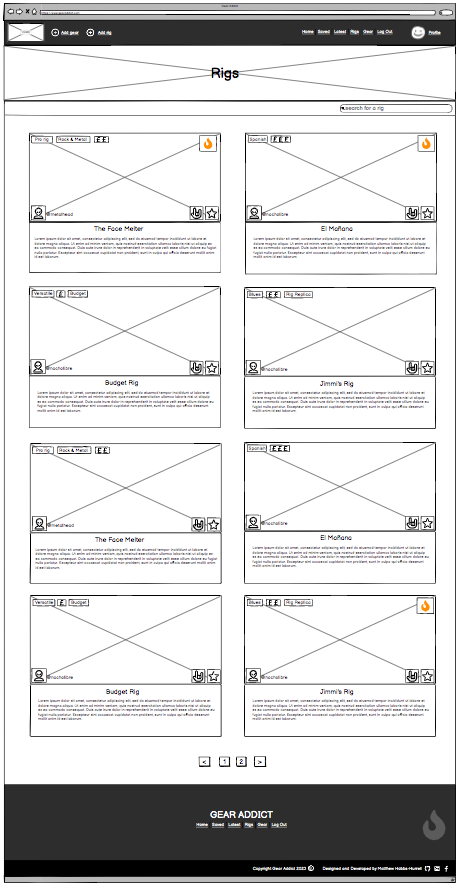
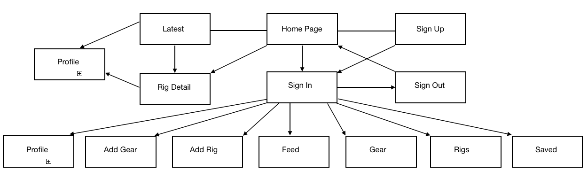

# **Gear Addict**

Gear Addict is an online application that allows users to add and categorise their music gear, and also share details about their live rigs with the community. Users can interact with other users by becoming a fan, as well as liking, commenting and saving rigs.

This project was built as the final portfolio submission for the [Code Institute](https://codeinstitute.net/) Higher National Diploma in Full Stack Software Development. 

The project has been split into two parts - the front-end built with [React](https://react.dev/), and the back-end API powered by the [Django REST Framework](https://www.django-rest-framework.org/). 

More information on the back-end of the site can be found in the back-end [README](https://github.com/Matthew-Hurrell/gear-addict-api/blob/main/README.md).

Link to the live site - [Gear Addict Live Site](https://gear-addict-react.herokuapp.com/)

Link to the live API - [Gear Addict Live API](https://gear-addict.herokuapp.com/)

Link to the back-end repository - [Gear Addict Back-End Repo](https://github.com/Matthew-Hurrell/gear-addict-api)

# Contents

* [**Project**](<#project>)
    * [Objective](<#objective>)
    * [Site User Goal](<#site-user-goal>)
    * [Site Owner Goal](<#site-owner-goal>)
    * [Target Audience](<#target-audience>)
    * [**Project Management**](<#project-management>)
        * [GitHub Project Board](<#github-project-board>)
        * [Database Schema](<#database-schema>)
* [**User Experience UX**](<#user-experience-ux>)
    * [Wireframes](<#wireframes>)
    * [User Stories](<#user-stories>)
    * [Site Structure](<#site-structure>)
    * [Colour Scheme](<#colour-scheme>)
    * [Typography](<#typography>)
* [**Features**](<#features>)
    * [**Existing Features**](<#existing-features>)
        * [**Homepage**](<#homepage>)
        * [**Authorisation**](<#authorisation>)
            * [Sign Up](<#sign-up>)
            * [Log In](<#log-in>)
            * [Log Out](<#log-out>)
        * [**404 Page**](<#404-page>)
    * [**Future Features**](<#future-features>)
* [**Components**](<#components>)
* [**Technologies Used**](<#technologies-used>)
    * [Languages](<#languages>)
    * [Frameworks](<#frameworks>)
    * [Software](<#software>)
    * [Libraries](<#libraries>)
* [**Testing**](<#testing>)
    * [**Validator Tests**](<#validator-tests>)
        * [W3C (HTML)](<#w3c-html>)
        * [W3C (CSS)](<#w3c-css>)
        * [JSHint (JavaScript)](<#jshint-javascript>)
    * [**Input Validation Tests**](<#input-validation-tests>)
    * [**Additional Tests**](<#additional-tests>)
        * [Manual Tests](<#manual-tests>)
        * [Automated Tests](<#automated-tests>)
        * [Responsive Tests](<#responsive-tests>)
        * [Browser Tests](<#browser-tests>)
        * [Lighthouse Tests](<#lighthouse-tests>)
        * [Wave Accessibility Tests](<#wave-accessibility-tests>)
    * [**Bugs**](<#bugs>)
        * [Resolved](<#resolved>)
        * [Unresolved](<#unresolved>)
* [**Deployment**](<#deployment>)
    * [**Project Deployment Via Heroku**](<#project-deployment-via-heroku>)
* [**Credits**](<#credits>)
    * [**Content**](<#content>)
    * [**Media**](<#media>)
    * [**Code**](<#code>)
*  [**Acknowledgements**](<#acknowledgements>)

# Project

In this section I will detail the projects purpose and goals, as well as the project management methodologies used throughout the development process.

[Back to top](<#contents>)

## Objective

To provide a stable platform for music gear enthusiasts and collectors to organise and share their music gear and live rigs.

[Back to top](<#contents>)

## Site User Goal

Users of the Gear Addict site may have many different goals. They may wish to categorise and organise their music gear, or they may want to share their live setup with other users who have similar interests. They could just be interested in browsing other users live rigs for general interest or inspiration, or they may just wish to interact and network with the community to provide feedback.

[Back to top](<#contents>)

## Site Owner Goal

To provide a stable and enjoyable user experience that encourages continued user interaction and participation. The platform should be engaging and welcoming to new users. Content should be well structured and of high quality. Navigation and site functionality should be intuitive and accessible. 

[Back to top](<#contents>)

## Target Audience

The target audience is anyone who has an interest in live music performance and music gear. Most users will be musicians, but there could also be some collectors on the platform. Users could be male or female, but the site is styled more towards a young male audience, as this is likely to be the majority of the users. 

[Back to top](<#contents>)

## Project Management

An agile methodology was used to plan and develop the Gear Addict project. All the main features of the application were recorded as epics and then refined into user stories. These user stories were created and stored as GitHub issues and then mapped into iterations to help to plan and allocate the workload. 

[Back to top](<#contents>)

### GitHub Project Board

All the Gear Addict user stories were added to a GitHub project board to assist with tracking progress. All user stories started in the to-do section. On completion, each user story was moved into the done section and marked as closed. 

[Click here to view the Gear Addict Project Board](https://github.com/users/Matthew-Hurrell/projects/3)

[Back to top](<#contents>)

### Database Schema

More information on the database schema can be found on the [Gear Addict Back-end API project readme](https://github.com/Matthew-Hurrell/gear-addict-api/blob/main/README.md).

[Back to top](<#contents>)

# User Experience UX

This section will detail the planning and design choices for the Gear Addict application.

[Back to top](<#contents>)

## Wireframes

Wireframes for the Gear Addict project were created using [Balsamiq](https://balsamiq.com/). All wireframes were completed pre-development. These wireframes were used as the basis for the Gear Addict page and component designs. Some minor changes were made during the development process.

### Home Page

[Back to top](<#contents>)

### Sign Up Page

[Back to top](<#contents>)

### Sign-In Page

[Back to top](<#contents>)

### All Rigs Page

[Back to top](<#contents>)

### Rig Details Page

[Back to top](<#contents>)

### Saved Rigs Page

[Back to top](<#contents>)

### Add Rig Page

[Back to top](<#contents>)

### Add Gear Page

[Back to top](<#contents>)

### My Gear Page

[Back to top](<#contents>)

### Profile Page

[Back to top](<#contents>)

### 404 Page

[Back to top](<#contents>)

## User Stories

In terms of project management, user stories are an integral part of the software development creative process. Gear Addict consists of 60 user stories, each broken down into acceptance criteria and tasks. Each user story has a story points number in relation to the time / difficulty of the tasks, and a priority label signifying the importance of the feature. The user stories were created from 'Epics', which are large over-arching features/concepts. These epics were refined down into smaller individual parts and made into user stories. Completed user stories were marked as closed. Throughout development, user stories were sorted into weekly iterations that were used to structure and allocate the workload each week. Each iteration was planned to not include more than 60% must-have user stories.

A full list of user stories can be found in a separate file here - [Gear Addict User Stories](https://github.com/Matthew-Hurrell/gear-addict/blob/main/readme/userstories.md)

[Back to top](<#contents>)

## Site Structure

The site structure for the Gear Addict application was kept relatively simple and user-friendly to avoid confusion. The main site nav bar and footer nav are present on every page of the site, to allow for easy access to site navigation. Non-authenticated users have limited access to pages within the site, and this is reflected in the changing state of the nav menus. Non logged in users only have access to the home, latest, rig detail, other user profiles and log-in / sign-up auth pages. Authenticated users can access the add rig / gear forms as well as the feed, gear, rigs, saved, user profile page and sign-out functionality. 

[Back to top](<#contents>)

## Colour Scheme

The Gear Addict colour scheme colours were selected from the inbuilt Tailwind colours from the [Tailwind CSS Customizing Colors List](https://tailwindcss.com/docs/customizing-colors). They were chosen for their modern and professional look and feel.

[Back to top](<#contents>)

## Typography

Gear Addict uses [Google Fonts](https://fonts.google.com/) for its typography. [Roboto](https://fonts.google.com/specimen/Roboto?query=roboto) was used for headings, links and nav elements. Roboto is a neo-grotesque sans-serif typeface and it was chosen for its modern geometric look. [Cardo](https://fonts.google.com/specimen/Cardo?query=cardo) was used for paragraphs and lists. Cardo is a large Unicode font, and it was chosen to add some contrast between the Roboto font and because it works well for general typesetting.

[Back to top](<#contents>)

# Features

[Back to top](<#contents>)

## Existing Features

[Back to top](<#contents>)

## Future Features

[Back to top](<#contents>)

# Components

[Back to top](<#contents>)

# Technologies Used

[Back to top](<#contents>)

## Languages

[Back to top](<#contents>)

## Frameworks

[Back to top](<#contents>)

## Software

[Back to top](<#contents>)

## Libraries

[Back to top](<#contents>)

# Testing

[Back to top](<#contents>)

## Validator Tests

[Back to top](<#contents>)

### W3C HTML

[Back to top](<#contents>)

### W3C CSS

[Back to top](<#contents>)

### JShint Javascript

[Back to top](<#contents>)

## Input Validation Tests

[Back to top](<#contents>)

## Additional Tests

[Back to top](<#contents>)

### Manual Tests

[Back to top](<#contents>)

### Automated Tests

[Back to top](<#contents>)

### Responsive Tests

[Back to top](<#contents>)

### Browser Tests

[Back to top](<#contents>)

### Lighthouse Tests

[Back to top](<#contents>)

### Wave Accessibility Tests

[Back to top](<#contents>)

## Bugs

[Back to top](<#contents>)

### Resolved

[Back to top](<#contents>)

### Unresolved

[Back to top](<#contents>)

# Deployment

[Back to top](<#contents>)

## Project Deployment Via Heroku

[Back to top](<#contents>)

# Credits

[Back to top](<#contents>)

## Content

[Back to top](<#contents>)

## Media

[Back to top](<#contents>)

## Code

[Back to top](<#contents>)

# Acknowledgements

[Back to top](<#contents>)

DOCUMENT HOW COMPONENTS AND PAGES RELATE TO USER STORIES
DOCUMENT HOW FEATURES AND LIBRARIES HAVE IMPROVED USER EXPERIENCE